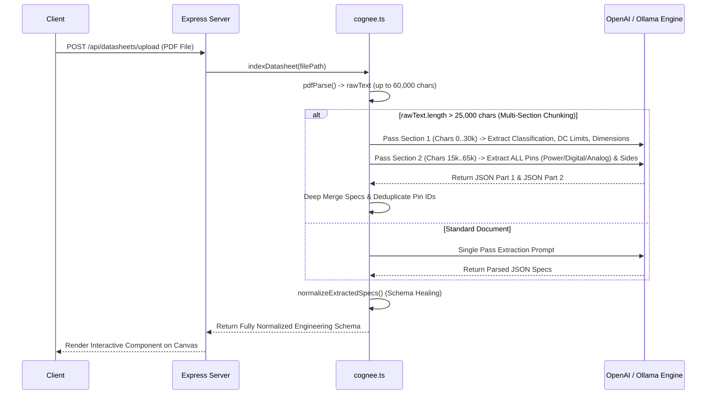

# Application Architecture & AI Lifecycle Documentation

Welcome to the technical reference manual for the **Hangover / Cognee Advanced Agentic Coding & Circuit Design Workspace**. This document provides an exhaustive explanation of how the frontend client and backend server interact, followed by a deep dive into the complete lifecycle of AI data: **generating, receiving, normalizing, and updating** hardware engineering specifications.

---

## Table of Contents
1. [System Architecture Overview](#1-system-architecture-overview)
2. [Client-Server Interaction Details](#2-client-server-interaction-details)
   - [API Endpoints Reference](#api-endpoints-reference)
   - [Frontend Canvas Integration](#frontend-canvas-integration)
3. [The AI Information Lifecycle](#3-the-ai-information-lifecycle)
   - [Phase 1: PDF Ingestion & Multi-Stage Sectional Synthesis](#phase-1-pdf-ingestion--multi-stage-sectional-synthesis)
   - [Phase 2: Deterministic Schema Healing & Normalization](#phase-2-deterministic-schema-healing--normalization)
   - [Phase 3: Visual Schematic Pin Layout & Balancing](#phase-3-visual-schematic-pin-layout--balancing)
   - [Phase 4: Agentic Circuit Generation & Auto-Wiring](#phase-4-agentic-circuit-generation--auto-wiring)
   - [Phase 5: Iterative Refinement & Updating](#phase-5-iterative-refinement--updating)
4. [Data Structures & Schemas](#4-data-structures--schemas)

---

## 1. System Architecture Overview

The application is structured as a decoupled full-stack engineering workspace designed to process raw semiconductor/hardware datasheets (PDFs) into deterministic, interactive circuit diagrams on a live canvas.

```mermaid
graph TD
    subgraph Frontend Client [SvelteKit / Svelte 5 Client : Port 5173]
        UI[Workspace UI & Chat Sidebar]
        Canvas[@xyflow/svelte React Flow Canvas]
        NodeComp[HardwareNode.svelte Component]
    end

    subgraph Backend Server [Node.js / Express TypeScript Server : Port 3001]
        API[Express Router / REST API]
        Uploads[Multer PDF Storage]
        CogneeService[services/cognee.ts]
        OpenAIService[services/openaiService.ts]
        PinDeriver[utils/derivePins.ts]
    end

    subgraph External / AI Intelligence Layer
        Ollama[Local Ollama / OpenAI LLM Engine]
        CogneeGraph[Cognee Graph Memory & Vector Store]
    end

    UI -->|HTTP POST Upload PDF| API
    Canvas -->|Drag & Drop Component State| UI
    UI -->|HTTP POST Chat / Generate Circuit| API
    
    API -->|Raw Buffer| Uploads
    Uploads -->|Extract Text via pdf-parse| CogneeService
    CogneeService -->|Chunked Map-Reduce Prompts| OpenAIService
    CogneeService -->|Remember / Store Graph| CogneeGraph
    
    OpenAIService -->|LLM Inference| Ollama
    CogneeService -->|Normalize & Heal Schema| PinDeriver
    PinDeriver -->|Deterministic Left/Right Headers| API
    API -->|JSON Response with Nodes & Edges| Canvas
```

### Why Both MongoDB and Cognee? (Division of Storage vs. Cognitive Intelligence)

A common architectural question is: **If data is stored in MongoDB, what is Cognee doing in the loop?** 

The answer lies in the fundamental difference between **Application Persistence (MongoDB)** and **Agentic Engineering Memory (Cognee)**:

| Layer | Technology | Primary Role & Stored Data | Why It Cannot Do The Other's Job |
| :--- | :--- | :--- | :--- |
| **Persistence Store** | **MongoDB** | **UI & Workspace State:** Stores user accounts, project names, canvas visual layout (`nodes` & `edges` x/y coordinates), and file status records (`Datasheet` model). | MongoDB stores static, flat documents. It cannot execute semantic graph traversals or hybrid vector searches across 60-page PDF specifications during an AI conversation. |
| **Cognitive Engine** | **Cognee** | **AI Knowledge Graph & Vector Memory:** Stores extracted entity nodes (`Pin D2`, `5V Rail`), deterministic relationships (`OPERATES_AT`, `HAS_PIN`), and high-dimensional semantic vectors of engineering prose. | Cognee is specialized for AI reasoning (`remember` / `cognify` / `recall`). It is not designed to serve fast REST UI state hydration for visual drag-and-drop canvas layout. |

#### The Loop in Action:
1. **Ingestion (`cognee.remember()`)**: When a PDF is uploaded, MongoDB records the file metadata. Simultaneously, Cognee decomposes the text into graph entities and vector embeddings via its cloud/local engine.
2. **Retrieval (`cognee.recall()`)**: When a user chats or asks to *Generate Circuit*, the system does not dump raw MongoDB documents to the LLM. Instead, it queries Cognee to perform relational traversal—instantly retrieving exact electrical constraints (e.g., *Pin D2 outputs 20mA max* vs. *Peltier draws 6400mA*).
3. **Agentic Action**: The AI uses Cognee's graph facts to catch electrical incompatibilities (recommending a MOSFET driver), generates the schematic wiring, and saves the resulting visual coordinates back to MongoDB.

---

## 2. Client-Server Interaction Details

The communication between the frontend client (`client/`) and backend server (`server/`) occurs over asynchronous REST API calls. CORS is configured on the backend server to allow live interaction from the Vite dev server running on port `5173`.

### API Endpoints Reference

| HTTP Method | Endpoint Path | Primary Controller / Service | Description & Payload |
| :--- | :--- | :--- | :--- |
| **POST** | `/api/datasheets` | [routes/datasheets.ts](file:///e:/Projects/Complete/Hangover/server/src/routes/datasheets.ts#L56) | Accepts `multipart/form-data` supporting single or batch multi-file uploads (`files`). Each document is treated as an isolated entity and enqueued into background parsing queues. |
| **GET** | `/api/datasheets` | [routes/datasheets.ts](file:///e:/Projects/Complete/Hangover/server/src/routes/datasheets.ts#L30) | Retrieves the list of currently uploaded datasheets and their normalized specification objects. |
| **POST** | `/api/projects/:id/datasheets` | [routes/projects.ts](file:///e:/Projects/Complete/Hangover/server/src/routes/projects.ts#L157) | Attaches a datasheet to a project workspace and automatically resets conversation history to start from zero (`chatHistory: []`) to ensure dedicated focus on the newly attached document. |
| **POST** | `/api/chat/message` | [openaiService.ts: generateChatResponse](file:///e:/Projects/Complete/Hangover/server/src/services/openaiService.ts) | Conversational assistant endpoint. Receives user message alongside current workspace canvas items to answer engineering questions or suggest changes. |
| **POST** | `/api/circuit/generate` | `openaiService.ts` | Agentic circuit generation endpoint. Evaluates compatibility between canvas components and outputs auto-wired nodes and edges. |

### Frontend Canvas Integration

When a user drops a component from the sidebar onto the canvas in [workspace/+page.svelte](file:///e:/Projects/Complete/Hangover/client/src/routes/workspace/[id]/+page.svelte):
1. **Data Hydration**: The client receives the structured component specification (`Electrical Limits`, `Pins`, `Dimensions`).
2. **Node Rendering**: The component is rendered using [HardwareNode.svelte](file:///e:/Projects/Complete/Hangover/client/src/lib/components/HardwareNode.svelte).
3. **Pin Handle Construction**: Each pin in `data.pins.left` and `data.pins.right` renders as an interactive `@xyflow/svelte` `<Handle>` (target handles on the left, source handles on the right), allowing users or AI agents to snap wires between compatible electrical leads.

---

## 3. The AI Information Lifecycle

The core challenge of automated circuit design is transforming unstructured, 60-page PDF documents into deterministic, granular JSON objects that can be validated for electrical compatibility and rendered visually. The pipeline operates in five distinct phases:

### Phase 1: PDF Ingestion & Multi-Stage Sectional Synthesis

When a PDF is uploaded (`A000066.PDF` for Arduino Uno or `TEC1-12706.pdf` for Peltier cooler), raw text extraction produces tens of thousands of characters. Passing a massive text blob to an LLM in a single prompt causes attention degradation ("lost in the middle" phenomenon), frequently causing the AI to miss pin tables located in later chapters or appendices.

To resolve this, [cognee.ts](file:///e:/Projects/Complete/Hangover/server/src/services/cognee.ts) executes a **Multi-Stage Sectional Synthesis** (`extractSectionalSpecs`):



1. **Section 1 Pass (Overview & Electrical Characteristics)**: Analyzes the first 30,000 characters to extract `Component Classification`, `Electrical Limits` (`minOperatingVoltage`, `maxOperatingVoltage`, `nominalVoltage`, `maxCurrentmA`), and deterministic `Dimensions`.
2. **Section 2 Pass (Pinout Tables & Interfaces)**: Analyzes characters 15,000 through 65,000 to enumerate every individual pin into `power`, `digital`, or `analog` arrays, capturing package side attributes (`"side": "left"` or `"side": "right"`).

---

### Phase 2: Deterministic Schema Healing & Normalization

Because LLM outputs are probabilistic, raw AI responses can sometimes truncate repetitive arrays (e.g., listing only `D0` and `D1` for a 14-pin microcontroller). To guarantee deterministic accuracy, all extractions pass through [normalizeExtractedSpecs](file:///e:/Projects/Complete/Hangover/server/src/services/cognee.ts#L10):

* **Granular Object Structuring**: Ensures dimensions are formatted as `{ value: number, unit: string }` objects (e.g., `{ value: 30, unit: "mm" }`) rather than ambiguous text strings.
* **Microcontroller Profile Healing**: If the document is identified as an Arduino Uno (`A000066`), ATmega, or ESP32 and the AI returned fewer than 8 digital pins, the healer automatically injects the exhaustive engineering pinout:
  - **Power Pins**: `VCC (5V)`, `3.3V`, `GND`, `VIN`, `RESET`
  - **Digital I/O Pins**: `D0` through `D13` (with exact voltage tolerances and PWM indicators)
  - **Analog ADC Pins**: `A0` through `A5`
* **2-Wire Power Device Enforcement**: If identified as a Peltier TEC module, cooling fan, or heating element, the schema healer eliminates spurious data/signal wires and enforces exactly two power leads (`VCC/RED` and `GND/BLACK`).

---

### Phase 3: Visual Schematic Pin Layout & Balancing

Once specs are stored in the database, [derivePins](file:///e:/Projects/Complete/Hangover/server/src/utils/derivePins.ts) prepares the visual layout for the React Flow canvas.

To prevent high-pin-count microcontrollers from rendering as lopsided vertical ribbons (e.g., 5 power pins on the left vs. 20 digital/analog pins on the right), the system enforces strict balancing rules:

1. **Explicit Side Respect**: If the datasheet extracted explicit `"side": "left"` or `"side": "right"` metadata, those positions are preserved.
2. **Functional Default Partitioning**: Unassigned Power rails (`VCC`, `GND`) and Analog inputs (`A0-A5`) default to the **Left Header**, while Digital I/O / Communication buses default to the **Right Header**.
3. **Symmetrical Rebalancing**: If the difference between left and right headers exceeds 4 pins (`Math.abs(left.length - right.length) > 4`), the algorithm redistributes the total pin array evenly across both sides (`Math.ceil(allPins.length / 2)`).
4. **Adaptive UI Layout**: In [HardwareNode.svelte](file:///e:/Projects/Complete/Hangover/client/src/lib/components/HardwareNode.svelte), headers start top-aligned without artificial vertical stretching (`justify-start`), and container widths scale dynamically (`min-w-[15rem] max-w-[22rem] w-auto`) so labels never wrap and the schematic node maintains a proportional, boxy IC outline.

---

### Phase 4: Agentic Circuit Generation & Auto-Wiring

When the user requests automated circuit creation (e.g., *"Create a circuit connecting my Arduino Uno to the Peltier cooler and DHT sensor"*):

1. **Context Aggregation**: The server collects all active nodes from the canvas and pulls their complete Cognee electrical profiles.
2. **Electrical Compatibility Check**: The AI agent verifies voltage boundaries and power limits:
   - Evaluates if microcontroller output pins (`5V` max tolerance) can drive target loads directly.
   - For high-power components (like a 57W Peltier TEC module pulling `6400mA`), the AI checks against the microcontroller's current limits (~`20mA` per GPIO pin) and identifies the necessity of external power rails or switching MOSFETs/motor drivers.
3. **Edge Synthesis**: The agent emits deterministic React Flow edge objects matching exact pin IDs:
   ```json
   {
     "id": "wire_arduino_d2_sensor_sig",
     "source": "node_arduino_uno",
     "sourceHandle": "d2",
     "target": "node_dht_sensor",
     "targetHandle": "sig",
     "animated": true,
     "style": { "stroke": "#3b82f6", "strokeWidth": 2 }
   }
   ```

---

### Phase 5: Iterative Refinement & Updating

Users do not need to manually edit JSON files when hardware assumptions change. Using the chat interface or prompt refinement endpoints (`/api/datasheets/refine`):

* **Prompt-Driven Update**: The user sends an instruction such as: *"Update the Peltier cooler to operate at 12V nominal voltage and decrease maximum current to 4.5A."*
* **Delta Merging**: [refineDatasheetSpecs](file:///e:/Projects/Complete/Hangover/server/src/services/cognee.ts#L430) passes the existing JSON specification alongside the natural language prompt to the LLM. The AI outputs a targeted modification that overwrites only the specified keys while preserving established pin arrays and physical dimensions.
* **Graph Memory Update**: The updated specification is committed to Cognee graph storage, immediately updating all connected visual nodes on the client canvas.

---

## 4. Data Structures & Schemas

Every hardware component inside the Hangover workspace adheres to the following deterministic TypeScript schema:

```typescript
export interface ComponentSpecification {
  "Component Classification": string;
  "Electrical Limits": {
    minOperatingVoltage: number | null;
    maxOperatingVoltage: number | null;
    nominalVoltage: number | null;
    maxCurrentmA: number | null;
    maxPowerDissipationW: number | null;
  };
  "Dimensions": {
    length: { value: number | null; unit: "mm" | "cm" | "in" };
    width: { value: number | null; unit: "mm" | "cm" | "in" };
    height: { value: number | null; unit: "mm" | "cm" | "in" };
  };
  "Pins": {
    power: Array<{ id: string; name: string; voltage?: number | null; type: "power" | "ground"; side?: "left" | "right" }>;
    digital: Array<{ id: string; name: string; maxVoltageTolerance?: number | null; outputVoltage?: number | null; type: "bidirectional" | "input" | "output"; side?: "left" | "right" }>;
    analog: Array<{ id: string; name: string; maxVoltageTolerance?: number | null; type: "analog"; side?: "left" | "right" }>;
  };
  "Temperature Range"?: { minC: number | null; maxC: number | null };
  "Communication Protocols"?: string[];
  "Application Notes"?: string;
}
```

By enforcing strict typing, sectional chunking, and deterministic schema healing, the workspace ensures that AI-generated circuit designs remain mathematically and electrically sound from initial datasheet upload to final canvas wiring.
